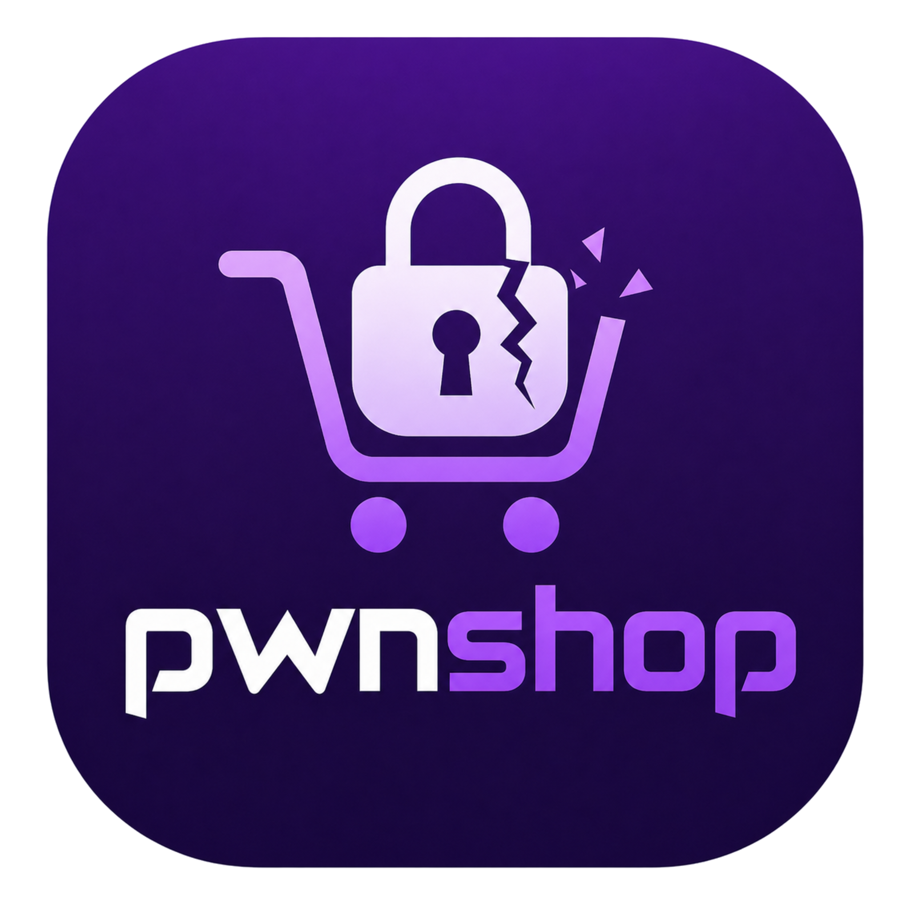

<div align="center">
  

  <h1>PwnShop Mobile</h1>
  <p><strong>Intentionally Vulnerable Mobile E-Commerce App for Penetration Testing Training</strong></p>

  <p>
    
    
    
    
    
    
    
  </p>

  <p>
    Built by <strong>Ibrahim Mutiu Olajide</strong> - <a href="https://github.com/r007sec">r007sec</a> | <strong>CTF Security</strong>
  </p>

  <p>
    <a href="https://github.com/r007sec/pwnshop">🌐 Web Version</a> &nbsp;·&nbsp;
    <a href="https://github.com/r007sec/pwnshop-mobile/releases">📥 Download APK</a> &nbsp;·&nbsp;
    <a href="EXPLOITATION_GUIDE.md">🎯 Exploitation Guide</a>
  </p>
</div>

---

## Overview

PwnShop Mobile is the Android companion to [PwnShop Web](https://github.com/r007sec/pwnshop) - a fully functional e-commerce platform deliberately built with **36 documented security vulnerabilities** spanning OWASP Mobile Top 10 (2024), OWASP LLM Top 10 (2025), and real-world API/business logic flaws.

It is designed for:
- **CTF competitions** - each vulnerability has a unique PWN-ID and difficulty rating
- **Mobile security training** - hands-on practice with Android-specific attack surfaces
- **Security awareness workshops** - demonstrate real attack scenarios in a safe environment
- **Penetration testing courses** - realistic target with buyer, seller, and admin workflows

> ⚠️ **This app is intentionally insecure. Never deploy it in a production environment or against real users. For educational use only.**

---

## What Makes It Realistic

Unlike generic vulnerable apps, PwnShop Mobile mirrors a real Nigerian e-commerce platform (Jumia/Konga-style) with:

- Live **VulnBank** payment integration (intentionally vulnerable banking API)
- Real commission calculations, logistics fees, and VAT by product category
- **Groq API** AI chatbot with 10 LLM-specific vulnerabilities (prompt injection, excessive agency, context leakage)
- Three distinct user roles - **buyer**, **seller**, **admin** - each with their own attack surface
- Backend deployed on **Render** (always-on free tier) - no local setup required to attack

---

## Vulnerability Summary

| Category | Count | OWASP Mapping |
|---|---|---|
| OWASP Mobile Top 10 (2024) | 23 | M1–M10 |
| OWASP LLM Top 10 (2025) | 10 | LLM01–LLM10 |
| Business Logic & API | 14 | OWASP API Top 10 |
| **Total** | **47** | |

| Difficulty | Count |
|---|---|
| Easy | 12 |
| Medium | 14 |
| Hard | 10 |

---

## Tech Stack

| Layer | Technology |
|---|---|
| Mobile Framework | React Native 0.81 + Expo SDK 54 |
| Routing | Expo Router (file-based) |
| Backend | Node.js 22 + Express |
| Database | SQLite (intentionally unencrypted) |
| Auth | JWT (intentionally accepts `alg:none`) |
| Passwords | MD5 (no salt - intentional) |
| AI Chatbot | Groq API - LLaMA 3.3 70B |
| Payments | VulnBank API (intentionally vulnerable) |
| Build | EAS Build (Expo Application Services) |
| Hosting | Render (free tier) |
| Storage | AsyncStorage plaintext (intentional) |
| Vulnerable Library | Lodash 4.17.4 - CVE-2019-10744 |

---

## Quick Start - Install the APK

**No setup required.** The backend is live at `https://pwnshop-backend.onrender.com`.

1. Download the latest APK from the [Releases page](https://github.com/r007sec/pwnshop-mobile/releases)
2. Enable **Install from Unknown Sources** on your Android device
3. Install and launch PwnShop

> ℹ️ **Tip for CTF participants:** Use a rooted Android emulator (e.g. Genymotion or Android Studio AVD with root) for vulnerabilities that require filesystem access.

---

## Build from Source

### Prerequisites

- Node.js 20+
- Expo CLI: `npm install -g expo-cli`
- EAS CLI: `npm install -g eas-cli`

### Frontend (React Native)

```bash
git clone https://github.com/r007sec/pwnshop-mobile.git
cd pwnshop-mobile
npm install
npx expo start
```

The app connects to the live backend by default (`https://pwnshop-backend.onrender.com`).

To point at a local backend, edit `constants/config.js`:

```js
export const CONFIG = {
  BASE_URL: "http://YOUR_LOCAL_IP:3001",
  API_URL:  "http://YOUR_LOCAL_IP:3001",
};
```

### Backend (Local)

```bash
git clone https://github.com/r007sec/pwnshop-backend.git
cd pwnshop-backend
cp .env.example .env   # fill in your values
npm run dev
```

### Build APK

```bash
eas build -p android --profile preview
```

---

## Default Accounts

| Role | Email | Password | Notes |
|---|---|---|---|
| Admin | `admin@pwnshop.com` | `admin123` | Full admin panel access |
| Seller | `seller@pwnshop.com` | `seller123` | Seller dashboard + products |
| Buyer | `buyer@pwnshop.com` | `buyer123` | Shopping + wallet |
| Buyer 2 | `alice@pwnshop.com` | `alice123` | For IDOR testing |

All accounts start with **₦10,000 wallet balance** (Welcome Bonus - itself a vulnerability: PWN-A004).

---

## App Features

### Buyer
- Browse products by category, price, brand, and rating
- Search (SQL injection here - PWN-M007)
- Product detail with image gallery, delivery zone selector, reviews
- Shopping cart with coupon codes (discount manipulation - PWN-A005)
- Checkout via PwnShop wallet or direct VulnBank payment
- Order history and delivery tracking
- AI chatbot powered by Groq (10 LLM vulnerabilities)
- Wallet: fund via VulnBank, transaction history
- Two-Factor Authentication (bypassable - PWN-M021)
- Referral code system (bonus abuse - PWN-A004)
- Wishlist

### Seller
- Seller dashboard: sales, earnings, pending balance
- Add/edit/delete products with multi-image upload (path traversal - PWN-M008)
- Sales history with commission breakdown per order
- Earnings wallet: withdraw to VulnBank account
- Seller analytics: revenue chart by week/month

### Admin
- Dashboard: total revenue (logistics + commission + VAT + withdrawal fees)
- User management: change roles, top up wallets, ban/unban
- Order management: change status, resolve disputes
- Product management: feature products, flash sale pricing
- Seller management: approve/reject, grant verified badge
- Coupon management: generate `PWNS-XXXX-XXXX` codes
- Activity logs, security logs, chat logs, error logs
- VulnBank transaction logs (account numbers + PINs in plaintext - PWN-A014)
- **Lab Reset** - wipe all runtime data for fresh training sessions

---

## Vulnerability Index

See [EXPLOITATION_GUIDE.md](EXPLOITATION_GUIDE.md) for step-by-step exploit instructions.

### OWASP Mobile Top 10 (2024)

| ID | Vulnerability | Category | Difficulty |
|---|---|---|---|
| PWN-M001 | Hardcoded Groq API key in APK source | M1 - Improper Credential Usage | Easy |
| PWN-M002 | Hardcoded DB password committed to GitHub | M1 - Improper Credential Usage | Easy |
| PWN-M003 | Lodash prototype pollution - CVE-2019-10744 | M2 - Supply Chain | Hard |
| PWN-M004 | Outdated express-session - session fixation | M2 - Supply Chain | Hard |
| PWN-M005 | JWT `alg:none` - signature bypass | M3 - Insecure Auth | Medium |
| PWN-M006 | Predictable 4-digit OTP, no lockout | M3 - Insecure Auth | Easy |
| PWN-M007 | SQL injection in product search | M4 - Input Validation | Medium |
| PWN-M008 | Path traversal in product image upload | M4 - Input Validation | Medium |
| PWN-M009 | No TLS - plaintext credentials on WiFi | M5 - Insecure Communication | Easy |
| PWN-M010 | No certificate pinning - MITM attack | M5 - Insecure Communication | Medium |
| PWN-M011 | PII and JWT tokens written to device logs | M6 - Privacy Controls | Easy |
| PWN-M012 | VulnBank credentials silently copied to clipboard | M6 - Privacy Controls | Easy |
| PWN-M013 | APK unobfuscated - full source readable | M7 - Binary Protections | Easy |
| PWN-M014 | WebView loads arbitrary URLs - XSS via product | M7 - Binary Protections | Medium |
| PWN-M015 | Exported Android Activity - admin panel without login | M8 - Security Misconfiguration | Medium |
| PWN-M016 | Debug API endpoints active in production | M8 - Security Misconfiguration | Easy |
| PWN-M017 | JWT tokens in AsyncStorage plaintext | M9 - Insecure Data Storage | Easy |
| PWN-M018 | SQLite database unencrypted on rooted device | M9 - Insecure Data Storage | Medium |
| PWN-M019 | MD5 password hashing - crackable in seconds | M10 - Insufficient Cryptography | Easy |
| PWN-M020 | AES-ECB wallet encryption - pattern leakage | M10 - Insufficient Cryptography | Hard |
| PWN-M021 | 2FA bypass via response manipulation | M3 - Insecure Auth | Medium |
| PWN-M022 | Wallet visible in Android recent apps screenshots | M6 - Privacy Controls | Easy |
| PWN-M023 | Insecure deep links bypass authentication | M8 - Security Misconfiguration | Medium |

### OWASP LLM Top 10 (2025)

| ID | Vulnerability | Category | Difficulty |
|---|---|---|---|
| PWN-L001 | Direct prompt injection - system prompt leak | LLM01 | Easy |
| PWN-L002 | Indirect injection via malicious product description | LLM01 | Medium |
| PWN-L003 | Stored XSS via unvalidated LLM output in WebView | LLM01 | Hard |
| PWN-L004 | Sensitive data disclosure via LLM context (`process.env`) | LLM02 | Easy |
| PWN-L005 | Cross-user data leakage - all orders in context | LLM02 | Easy |
| PWN-L006 | Excessive agency - wallet top-up via chat | LLM06 | Hard |
| PWN-L007 | System prompt leakage via jailbreak | LLM07 | Medium |
| PWN-L008 | Model DoS via context flooding | LLM04 | Easy |
| PWN-L009 | Conversation history poisoning | LLM04 | Medium |
| PWN-L010 | Insecure output handling - order creation via chat | LLM05 | Hard |

### Business Logic & API

| ID | Vulnerability | Difficulty |
|---|---|---|
| PWN-A001 | IDOR on order details - sequential IDs | Easy |
| PWN-A002 | Mass assignment - instant admin via register body | Easy |
| PWN-A003 | Client-side price manipulation at checkout | Easy |
| PWN-A004 | Welcome bonus endpoint abuse - unlimited credits | Easy |
| PWN-A005 | Coupon discount override - negative order total | Medium |
| PWN-A006 | VulnBank funding amount override - no balance check | Medium |
| PWN-A007 | BOLA - seller edits any seller's product | Medium |
| PWN-A008 | No rate limiting - brute force login | Easy |
| PWN-A009 | Verbose errors expose full stack traces | Easy |
| PWN-A010 | Stored XSS in product reviews | Medium |
| PWN-A011 | Stock check bypass - buy out-of-stock items | Easy |
| PWN-A012 | Race condition on wallet withdrawal | Hard |
| PWN-A013 | JWT not invalidated on logout - 30-day token | Medium |
| PWN-A014 | Broken function-level auth - users access admin routes | Medium |

---

## Lab Reset

Instructors can reset all runtime data without wiping user accounts or products:

```
POST /api/admin/reset-lab
Authorization: Bearer <admin JWT>
Body: { "confirm": "RESET_PWNSHOP_LAB" }
```

> 🔓 The confirmation string is hardcoded in the APK source - decompile to find it, then combine with PWN-A014 to trigger a reset as a non-admin.

---

## Related Projects

| Project | Description |
|---|---|
| [PwnShop Web](https://github.com/r007sec/pwnshop) | The original web version - 45 vulnerabilities including SSTI→RCE and SQL injection |
| [VulnBank](https://vulnbank.org) | Intentionally vulnerable banking API used for payment integration |

---

## Credits & License

Built by **Ibrahim Mutiu Olajide** ([@r007sec](https://github.com/r007sec))  
**CTF Security** - Cybersecurity training and research

> For educational and authorized security testing only. The author is not responsible for misuse.
